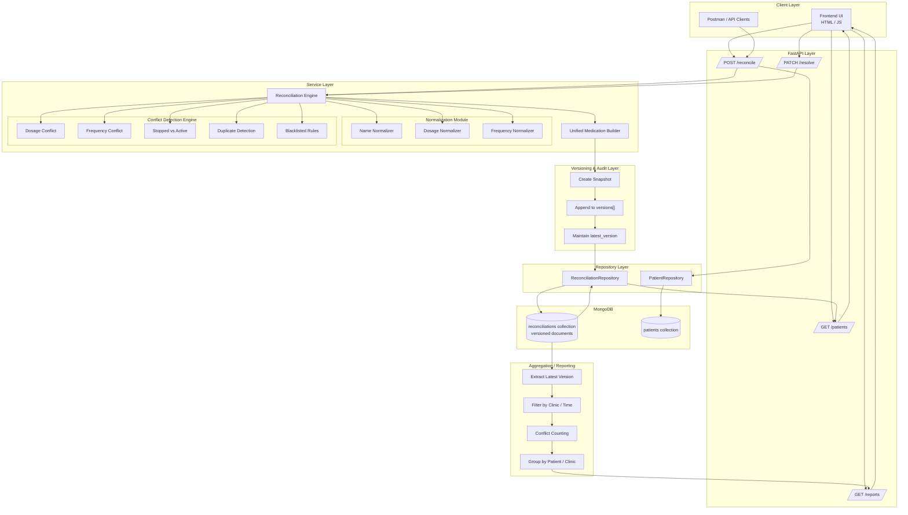

# Medication Reconciliation & Conflict Reporting Service

A **Medication Reconciliation & Conflict Reporting Service** designed for chronic-care workflows, with a primary focus on dialysis patients.

Medication data sourced from disparate systems — EMRs, hospital discharge summaries, and patient-reported records — frequently contains inconsistencies and conflicts. This service addresses that problem end-to-end by:

- Ingesting medication lists from multiple sources
- Normalizing and reconciling them into a unified view
- Detecting and categorizing conflicts across sources
- Maintaining a versioned longitudinal history with full snapshot support
- Enabling conflict resolution with a complete audit trail
- Providing clinic-level analytics and aggregated reporting

---

## Architecture



---

## Core Functionality

### 1. Multi-Source Medication Ingestion

Each reconciliation request carries medication data grouped by source, preserving its origin context throughout the pipeline.

```json
{
  "patient_id": "p1",
  "clinic_id": "clinic_a",
  "sources": [
    [{ "meds from EMR" }],
    [{ "meds from Patient" }],
    [{ "meds from Hospital" }]
  ]
}
```

Each medication entry retains its `source` field, ensuring traceability back to the originating system.

---

### 2. Canonical Normalization

Incoming medical data is inherently inconsistent. The system normalizes three key fields to bring all inputs into a canonical form before reconciliation.

#### a. Medication Name Normalization

The normalization pipeline applies the following steps in order:

1. Lowercasing and trimming of whitespace
2. Brand-to-generic and synonym mapping (e.g., `crocin` → `paracetamol`)
3. Fuzzy matching via `difflib.get_close_matches` to handle common typos

| Input | Normalized Output |
|---|---|
| `"Crocin"` | `"paracetamol"` |
| `"PCM"` | `"paracetamol"` |
| `"paracetmol"` | `"paracetamol"` |

#### b. Dosage Normalization

Dosages are extracted using the following regex pattern and standardized to milligrams:

```
(\d*\.?\d+)\s*(mg|g)?
```

| Input | Normalized Output |
|---|---|
| `"0.5g"` | `"500mg"` |
| `"500 mg"` | `"500mg"` |

#### c. Frequency Normalization

Multiple input formats are mapped to a canonical frequency label:

| Input | Normalized Output |
|---|---|
| `"OD"`, `"daily"` | `"once daily"` |
| `"BID"`, `"1-0-1"` | `"twice daily"` |
| `"TID"` | `"thrice daily"` |

> **Note:** The value `"stopped"` sets `is_stopped = True` on the medication entry.

---

### 3. Unified Medication Generation

After normalization, medications are grouped by their canonical drug name and aggregated into a single unified list. Each entry in the unified list includes the normalized name, dosage (if consistent across sources), frequency (if consistent), and all contributing sources.

---

### 4. Conflict Detection

Conflicts are detected on a per-drug basis across all contributing sources.

#### Dosage Mismatch
Triggered when the same drug appears with differing dosage values across sources.

```
EMR:     500mg
Patient: 650mg
→ DOSAGE_MISMATCH conflict
```

#### Frequency Mismatch
Triggered when the same drug is prescribed at different frequencies across sources.

#### Incomplete Data
Triggered when a medication entry is missing a dosage or frequency value.

```
dosage = null → flagged as incomplete
```

#### Duplicate Entry
Triggered when the same medication appears more than once within a single source.

#### Stopped vs. Active Conflict
Triggered when one source records a medication as stopped while another records it as active.

#### Blacklisted Combinations
A static JSON ruleset defines known unsafe drug combinations. If both drugs in a blacklisted pair are present in the unified list, a `HIGH` severity conflict is raised.

```json
["aspirin", "ibuprofen"]
```

---

### 5. Conflict Object Structure

Each conflict record stores the following fields:

```json
{
  "id": "uuid",
  "drug": "paracetamol",
  "type": "DOSAGE_MISMATCH",
  "severity": "HIGH",
  "values": ["500mg", "650mg"],
  "status": "unresolved",
  "resolved_at": null,
  "resolution_reason": null,
  "corrected_field": null,
  "corrected_value": null
}
```

---

## Versioning & Longitudinal Tracking

Rather than overwriting existing records, the system appends a new snapshot to a `versions` array on every reconciliation request:

```python
versions = [
    snapshot_1,
    snapshot_2,
    ...
]
```

Each snapshot contains the unified medication list, all detected conflicts, a timestamp, and an action label (`created` or `updated`). This design supports full audit trails, time-based analysis, and prevents destructive updates to historical data.

---

## Conflict Resolution

When a clinician resolves a conflict, the following payload is submitted:

```json
{
  "field": "dosage",
  "corrected_value": "500mg",
  "reason": "Doctor confirmed"
}
```

The system then:

1. Locates the conflict by ID
2. Updates its status to `resolved`, along with `resolved_at`, `resolution_reason`, `corrected_field`, and `corrected_value`
3. Propagates the correction to the unified medication list:
   - `field = dosage` → updates dosage on the relevant unified entry
   - `field = frequency` → updates frequency
   - `field = name` → renames the drug entry

The conflict is marked resolved, the unified list reflects the correction, and the full audit history is preserved.

---

## Multi-Clinic Support

Each reconciliation request includes a `clinic_id` field, enabling clinic-level analytics and supporting multi-tenant deployments.

---

## Reporting & Aggregation

All aggregation operations are performed against the **latest version** of each reconciliation document.

### Patients with Conflicts
Extracts the latest version for each patient, counts unresolved conflicts, and returns all patients with one or more.

### Conflict Summary (Time-based)
Filters records by the latest version timestamp within a configurable time window (e.g., 30 days), counts conflicts per patient, and groups results by clinic.

---

## Robustness & Input Handling

The system is designed to tolerate the kinds of noisy, inconsistent data encountered in real-world clinical environments.

| Input Issue | Handling |
|---|---|
| Missing medication name | Entry is skipped |
| Invalid dosage format | Treated as incomplete |
| Unrecognized frequency | Normalized where possible; flagged otherwise |
| Invalid source structure | Rejected via schema validation |

---

## Data Model

### Collection: `reconciliations`

#### ReconcileRequest

| Field | Type | Description |
|---|---|---|
| `patient_id` | `string` | Unique patient identifier |
| `clinic_id` | `string \| null` | Clinic identifier (default: `"default"`) |
| `sources` | `array<array<Medication>>` | Grouped medication lists, one array per source |

#### MedicationBase

| Field | Type | Description |
|---|---|---|
| `name` | `string` | Medication name |
| `dosage` | `string \| null` | Dosage value (e.g., `"500mg"`) |
| `frequency` | `string \| null` | Frequency value (e.g., `"once daily"`) |
| `source` | `string` | Origin source label (e.g., `"EMR"`, `"patient"`) |

#### ResolveRequest

| Field | Type | Description |
|---|---|---|
| `field` | `enum` | Field to correct — one of `"name"`, `"dosage"`, `"frequency"` |
| `corrected_value` | `string` | The corrected value to apply |
| `reason` | `string` | Audit reason for the resolution |

---

## API Reference

### Health

**`GET /api/v1/health/`**
Returns service health status.

---

### Medications

**`POST /api/v1/medications/`**
Creates a new medication entry for a patient.

| Field | Type | Required |
|---|---|---|
| `name` | `string` | Yes |
| `source` | `string` | Yes |
| `patient_id` | `string` | Yes |
| `dosage` | `string \| null` | No |
| `frequency` | `string \| null` | No |

**`GET /api/v1/medications/{patient_id}`**
Returns all medications for a given patient.

---

### Reconciliation

**`POST /api/v1/reconcile/`**
Ingests and reconciles medications from multiple sources.

| Field | Type | Required |
|---|---|---|
| `patient_id` | `string` | Yes |
| `sources` | `array<array<MedicationBase>>` | Yes |
| `clinic_id` | `string \| null` | No (default: `"default"`) |

**`GET /api/v1/reconcile/{patient_id}`**
Returns the full reconciliation history (all versions) for a patient.

**`PATCH /api/v1/reconcile/resolve/{reconciliation_id}/{conflict_id}`**
Resolves a specific conflict within a reconciliation.

```json
{
  "field": "dosage",
  "corrected_value": "500mg",
  "reason": "Doctor confirmed"
}
```

| Field | Type | Values |
|---|---|---|
| `field` | `enum` | `"name"`, `"dosage"`, `"frequency"` |
| `corrected_value` | `string` | The corrected value to apply |
| `reason` | `string` | Audit reason for the resolution |

---

### Reports

**`GET /api/v1/reports/conflicts`**
Returns a global conflict report across all patients.

| Query Parameter | Type | Default | Description |
|---|---|---|---|
| `min_conflicts` | `integer` | `1` | Minimum conflict count filter |
| `days` | `integer \| null` | — | Lookback window in days |

**`GET /api/v1/reports/clinic/{clinic_id}/patients-with-conflicts`**
Lists all patients with unresolved conflicts for a given clinic.

**`GET /api/v1/reports/clinic/conflict-summary`**
Returns an aggregated conflict summary across clinics within a time window.

| Query Parameter | Type | Default |
|---|---|---|
| `days` | `integer` | `30` |
| `min_conflicts` | `integer` | `2` |

---

### Patients

**`GET /api/v1/patients/`**
Lists all patients with pagination and sorting.

| Query Parameter | Type | Default | Constraints |
|---|---|---|---|
| `limit` | `integer` | `10` | 1–100 |
| `skip` | `integer` | `0` | >= 0 |
| `sort_by` | `string` | `"last_updated"` | — |

**`GET /api/v1/patients/{patient_id}`**
Returns details for a specific patient.

**`GET /api/v1/patients/{patient_id}/timeline`**
Returns the full versioned medication timeline for a patient.

---

## Setup

```bash
git clone https://github.com/nav-jk/Medication-Reconciliation-Conflict-Reporting-Service.git
cd Medication-Reconciliation-Conflict-Reporting-Service

python -m venv venv
venv\Scripts\activate  # Windows

pip install -r requirements.txt

uvicorn app.main:app --reload
```

---

## Tests

```bash
pytest -v
```

Test coverage includes reconciliation logic, conflict detection, versioning behavior, conflict resolution propagation, and aggregation endpoints.

---

## Seed Script

```bash
python scripts/seed_data.py
```

Generates 10–20 patients with multiple reconciliation versions per patient, using realistic noisy data with forced conflicts across dosage, frequency, and stopped-vs-active scenarios.

---

## Design Decisions & Assumptions

1. **No automatic conflict resolution.** Conflicts are never auto-resolved. All resolutions require a human decision with a documented reason, preserving clinical accountability.

2. **Versioning over mutation.** Every reconciliation request creates a new snapshot rather than overwriting the previous state, enabling complete longitudinal history.

3. **Denormalized document structure.** Optimized for read performance during aggregation, at the cost of some duplication across versions.

4. **Static conflict rules.** Drug interaction rules are defined in a static JSON file rather than integrated with an external database. This keeps the system self-contained and deterministic, while leaving room for future enhancement with a standardized ruleset such as RxNorm.

---

## Trade-offs

| Decision | Trade-off |
|---|---|
| Versioned documents | Larger document size over time |
| Denormalized structure | Data duplication across versions |
| No external drug database | Limited clinical accuracy for drug interactions |
| Rule-based normalization | Some edge cases in drug naming may be missed |

---

## Known Limitations

- No authentication or authorization layer
- Drug normalization relies on basic fuzzy matching; does not handle all real-world name variants
- No integration with a clinical drug interaction database
- No pagination on large result sets in all endpoints
- Conflict severity is heuristic rather than clinically validated

---

## Potential Next Steps

- Integrate a standardized drug database (RxNorm / SNOMED CT)
- Add authentication, role-based access control, and session management
- Build a clinician-facing dashboard for conflict review and resolution
- Improve normalization using NLP or ML-based entity recognition
- Add caching for aggregation endpoints to improve performance at scale

---

## AI Usage

AI assistance was used for FastAPI boilerplate scaffolding, debugging aggregation pipeline issues, and structuring initial test cases. All aggregation pipelines, data model decisions, and conflict resolution logic were manually reviewed and refined.

One notable point of disagreement: the AI initially suggested a flat schema for storing conflict data. This was rejected in favour of versioned snapshots, which more accurately models real-world medical history and supports the longitudinal tracking requirements of the system.

---

## Demo

A basic UI was built for demonstration purposes. A demo video can be found here: *(link pending)*

---

## Final Note

This system is designed with the realities of clinical data in mind — inconsistent inputs, absence of a single source of truth, and a strong need for auditability. The design prioritizes clarity, extensibility, and robustness over complexity.
